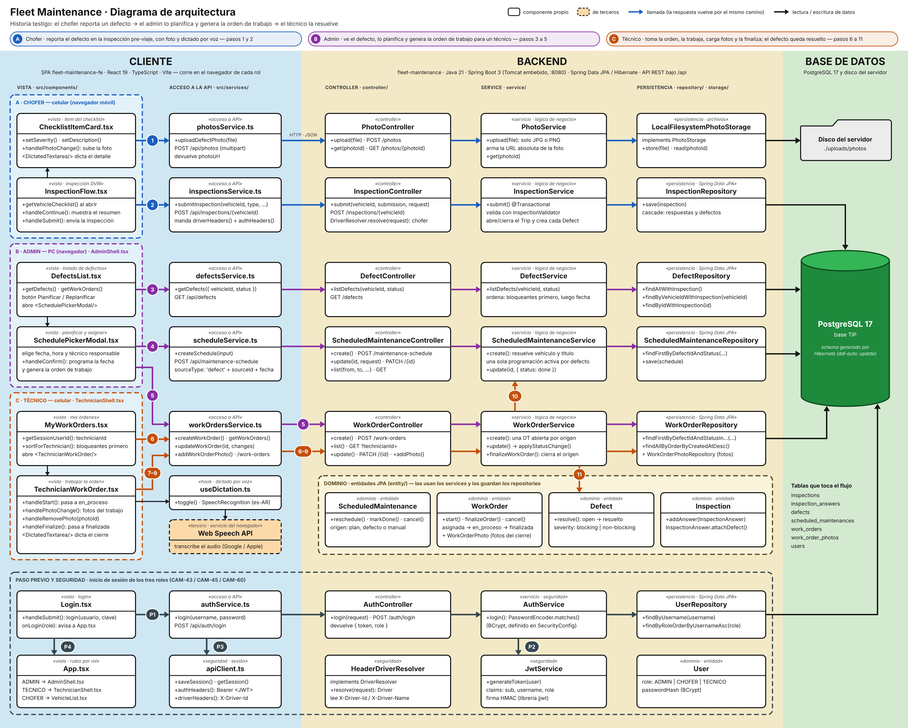

# Fleet Maintenance — Diagrama de arquitectura

**Historia testigo:** el chofer reporta un defecto en la inspección pre-viaje → el admin lo
planifica y genera la orden de trabajo → el técnico la resuelve y el defecto queda cerrado.

Relevado contra el código de `develop` de `fleet-maintenance` (este repo) y `fleet-maintenance-fe` el 2026-10-03.

## Recorrido

**A · Chofer (celular)**
1. Al marcar un ítem como defecto, saca la foto y `ChecklistItemCard.tsx` la sube al instante (`POST /api/photos`). Vuelve la URL de la foto.
2. Al confirmar, `InspectionFlow.tsx` envía la inspección completa (`POST /api/inspections/{vehicleId}`). El backend guarda la inspección, sus respuestas y el defecto en una sola transacción.

**B · Admin (PC)**
3. `DefectsList.tsx` trae los defectos reportados (`GET /api/defects`).
4. En "Planificar", `SchedulePickerModal.tsx` fija la fecha (`POST /api/maintenance-schedule`).
5. El mismo modal genera la orden de trabajo sobre esa programación y la asigna a un técnico (`POST /api/work-orders`).

**C · Técnico (celular)**
6. `MyWorkOrders.tsx` lista sus órdenes abiertas (`GET /api/work-orders?technicianId=`).
7. Inicia el trabajo: la orden pasa a `en_proceso` (`PATCH /api/work-orders/{id}`).
8. Sube las fotos del trabajo (`POST /api/photos`, igual que en el paso 1) y las asocia a la orden (`POST /api/work-orders/{id}/photos`).
9. Finaliza la orden con la descripción de cierre (`PATCH /api/work-orders/{id}`).
10. Al finalizar, `WorkOrderService` marca la programación como realizada.
11. En la misma transacción, marca el defecto como resuelto.

**Paso previo**
- P1. Login con usuario y contraseña (`POST /api/auth/login`).
- P2. `AuthService` pide el JWT a `JwtService`.
- P3. El frontend guarda la sesión (token + rol) con `apiClient.ts`.
- P4. `App.tsx` muestra la pantalla que corresponde al rol.

## Componentes del diagrama

### Cliente — vistas (`src/components/`)

- **ChecklistItemCard.tsx**: tarjeta de un ítem del checklist. El chofer lo marca como OK o como defecto; si es defecto elige la severidad (bloqueante / no bloqueante), escribe o dicta el título y el detalle, y saca la foto, que se sube en ese momento.
- **InspectionFlow.tsx**: pantalla de la inspección pre-viaje y post-viaje. Pide el checklist del vehículo, muestra un `ChecklistItemCard` por ítem, arma el resumen y envía todas las respuestas juntas.
- **DefectsList.tsx**: listado de defectos del admin. Muestra severidad, vehículo, foto y si ya hay una orden de trabajo abierta, y ofrece el botón Planificar / Replanificar.
- **SchedulePickerModal.tsx**: modal donde el admin elige fecha y hora, si el trabajo es interno o externo y el técnico responsable. Al confirmar crea la programación y, a continuación, la orden de trabajo asociada.
- **MyWorkOrders.tsx**: lista de órdenes abiertas del técnico logueado, con las de defectos bloqueantes primero.
- **TechnicianWorkOrder.tsx**: pantalla de trabajo del técnico. Permite iniciar la orden, cargar o quitar fotos, escribir o dictar la descripción de cierre y finalizarla.
- **Login.tsx**: formulario de usuario y contraseña. Al autenticar avisa a `App.tsx` con el rol.
- **App.tsx**: raíz de la aplicación. No usa router: según el rol de la sesión muestra el panel de admin (`AdminShell.tsx`), la vista del técnico (`TechnicianShell.tsx`) o la lista de vehículos del chofer (`VehicleList.tsx`).

### Cliente — acceso a la API (`src/services/`, `src/hooks/`)

- **photosService.ts**: sube una foto (`uploadDefectPhoto`) y devuelve su URL. Valida antes de enviar que el archivo sea JPG o PNG. Lo usan el chofer y el técnico.
- **inspectionsService.ts**: convierte las respuestas del checklist al formato de la API y envía la inspección (`submitInspection`).
- **defectsService.ts**: consulta los defectos, con filtros opcionales por vehículo y estado (`getDefects`).
- **scheduleService.ts**: crea, consulta y modifica las programaciones del calendario de mantenimiento (`createSchedule`, `getSchedule`, `updateSchedule`).
- **workOrdersService.ts**: todas las operaciones sobre órdenes de trabajo: crear, listar, cambiar de estado y manejar fotos y gastos.
- **authService.ts**: llama al login y devuelve el token y el rol.
- **apiClient.ts**: base común de los servicios. Guarda la sesión en `localStorage`, arma el header `Authorization: Bearer <JWT>` y los headers `X-Driver-Id` / `X-Driver-Name` del chofer, y unifica el manejo de errores (`ApiError`).
- **useDictation.ts**: hook de dictado por voz. Controla el reconocimiento de voz del navegador en español (es-AR) y entrega el texto transcripto al componente `DictatedTextarea.tsx`.

### Backend — controllers (`controller/`)

Solo capa HTTP: reciben el request, delegan en el service y arman la respuesta.

- **PhotoController**: recibe la foto como multipart (`POST /photos`) y la sirve después (`GET /photos/{photoId}`).
- **InspectionController**: recibe la inspección (`POST /inspections/{vehicleId}`). Identifica al chofer con `DriverResolver` antes de delegar.
- **DefectController**: expone el listado de defectos (`GET /defects`).
- **ScheduledMaintenanceController**: expone el calendario de mantenimiento: crear, modificar y listar programaciones (`/maintenance-schedule`). Responde 201 si creó una programación y 200 si reprogramó una existente.
- **WorkOrderController**: expone las órdenes de trabajo (`/work-orders`): crear, listar con filtros, ver detalle, actualizar, y cargar fotos y gastos.
- **AuthController**: expone el login (`POST /auth/login`).

### Backend — services (`service/`)

Concentran la lógica de negocio y la transaccionalidad (`@Transactional`).

- **PhotoService**: valida que la foto no esté vacía y sea JPG o PNG, la guarda a través de `PhotoStorage` y arma la URL absoluta con la que después se la referencia.
- **InspectionService**: caso de uso central del chofer. Verifica que el tipo de inspección corresponda al estado del vehículo, valida las respuestas contra el checklist con `InspectionValidator`, abre o cierra el viaje (`Trip`) y crea la inspección con sus respuestas y defectos en una sola transacción.
- **DefectService**: arma el listado de defectos con la patente del vehículo, ordenado por severidad (bloqueantes primero) y fecha.
- **ScheduledMaintenanceService**: decide cuándo se va a hacer un trabajo. Resuelve el vehículo y el título a partir del defecto, rechaza fechas pasadas y defectos ya resueltos, y mantiene una sola programación activa por defecto (si ya existe, la reprograma).
- **WorkOrderService**: crea y hace el seguimiento de las órdenes de trabajo. Garantiza una sola orden abierta por origen, valida que el responsable tenga rol técnico y controla las transiciones de estado. Al finalizar exige descripción de cierre y al menos una foto, y cierra el origen: marca la programación como realizada y el defecto como resuelto.
- **AuthService**: verifica usuario y contraseña (hash BCrypt) y devuelve el token y el rol.

### Backend — dominio (`entity/`)

- **Inspection**: inspección de un vehículo hecha por un chofer. Agrupa las respuestas (`InspectionAnswer`); cada respuesta puede tener un defecto asociado.
- **Defect**: defecto reportado, con severidad, título, detalle y foto. Nace en estado `open` y pasa a `resuelto` con `resolve()`.
- **ScheduledMaintenance**: fecha planificada para un trabajo, originada en un plan de mantenimiento, un defecto o una carga manual. Se puede reprogramar, marcar como realizada o cancelar.
- **WorkOrder**: orden de trabajo, con responsable, tipo de ejecución, fotos y gastos. Encapsula su ciclo de vida: `asignada → en_proceso → finalizada` (o `cancelada`).
- **User**: usuario del sistema, con su hash de contraseña y su rol (`ADMIN`, `CHOFER` o `TECNICO`).

### Backend — persistencia (`repository/`, `storage/`)

- **LocalFilesystemPhotoStorage**: implementación de `PhotoStorage` que guarda las fotos en un directorio del servidor. La interfaz permite cambiarla por un almacenamiento en la nube sin tocar el resto.
- **InspectionRepository**: guarda la inspección; por cascada se guardan también sus respuestas y defectos.
- **DefectRepository**: consulta los defectos junto con su inspección en una sola query, para evitar el problema de N+1.
- **ScheduledMaintenanceRepository**: busca la programación activa de un defecto y las programaciones de un rango de fechas.
- **WorkOrderRepository**: busca las órdenes por vehículo y la orden abierta de un mismo origen. `WorkOrderPhotoRepository` guarda y cuenta las fotos de cada orden.
- **UserRepository**: busca usuarios por nombre (login) y por rol (selector de técnicos).

### Backend — seguridad (`auth/`, `service/`, `config/`)

- **JwtService**: genera el JWT firmado con el id, el nombre de usuario y el rol. Usa la librería jjwt (de terceros).
- **HeaderDriverResolver**: implementación de `DriverResolver` que identifica al chofer a partir de los headers `X-Driver-Id` / `X-Driver-Name`.
- Estado actual: el backend valida el JWT solo en `/api/users` (`JwtAuthInterceptor`, exige un `ADMIN` activo). El resto de la API todavía no lo valida, y ahí la separación por rol se aplica en el frontend (`App.tsx`).

### Base de datos y almacenamiento

- **PostgreSQL 17** (base `TIP`): base de datos del sistema. Hibernate genera el schema al arrancar (`ddl-auto: update`). El flujo usa las tablas `inspections`, `inspection_answers`, `defects`, `scheduled_maintenances`, `work_orders`, `work_order_photos` y `users`.
- **Disco del servidor** (`./uploads/photos`): archivos de las fotos de defectos y de órdenes de trabajo. En la base solo se guarda la URL.

### Terceros

- **Web Speech API**: reconocimiento de voz del navegador. Transcribe el audio del dictado en servidores de Google o Apple; el audio no pasa por el backend de Fleet Maintenance.
